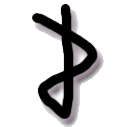

# Windows-Hooks

	

Windows-Hooks is not a real hook program, but some fun things developed using VC++  
The code may not be neat, just for fun 😁

## Development environment

> Visual Studio 2015 & VC++ v140 toolset is Required

 

## Function

1. Make Windows 10 taskbar transparent/translucent

2. Make Windows 10 desktop invisible/visible

3. Make Windows 10 startmenu invisible/visible

4. Make Windows 10 explorer window transparent/translucent

5. Execute programs

## License

Code licensed under the [Apache License 2.0](LICENSE).

